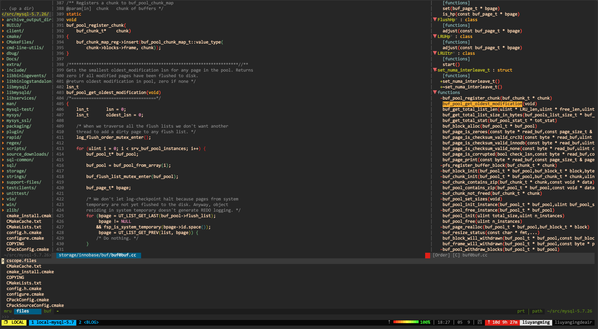
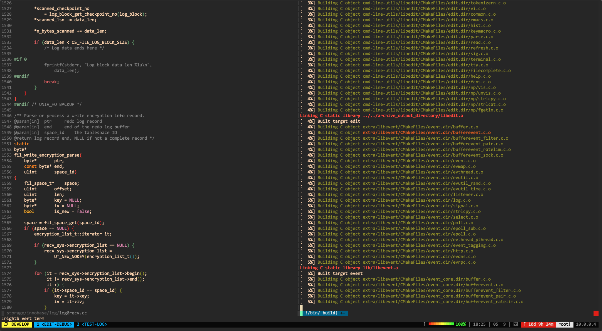
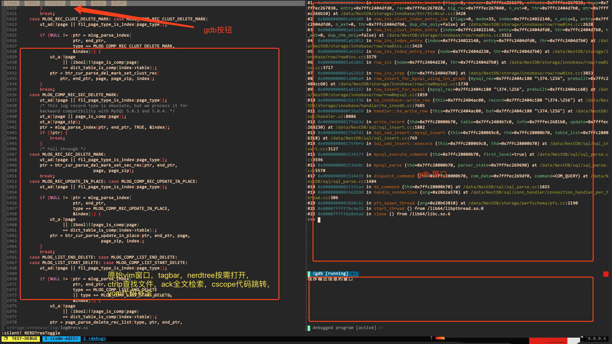

# Usage
vim configuration of C++ developer

# edit



# make



# debug



### Dependencies
```bash
brew install ack ctags cscope               # OS X
```
ctags推荐使用universal-ctags，直接源码安装:

```
git clone https://github.com/universal-ctags/ctags.git
cd ctags
./autogen.sh 
./configure
make
sudo make install
```

## Installation

1. Backup your old vim configuration files:

        mv ~/.vim ~/.vim.orig
        mv ~/.vimrc ~/.vimrc.orig

2. Clone and install this repo:

        git clone https://github.com/yummyliu/vimrc.git ~/.vim
        ln -s ~/.vim/vimrc ~/.vimrc

3. Setup `Vundle`:

        git clone https://github.com/VundleVim/Vundle.vim ~/.vim/bundle/Vundle.vim

4. Install bundles. Launch vim(ignore the errors and they will disappear after installing needed plugins)and run:

    ```
    :PluginInstall
    ```
    
5. 安装Python3 --enable-shared

    ```bash
    curl https://pyenv.run | bash
    export PYTHON_CONFIGURE_OPTS="--enable-shared"
    pyenv install 3.5.3
    pyenv global 3.5.3
    python3-config --configdir
    ```

6. 升级到Vim lastest

    ```
    git clone https://github.com/vim/vim.git
    cd vim
    git pull
    cd src
    make distclean  # if you build Vim before
    ./configure --with-features=huge --enable-multibyte --enable-rubyinterp=yes --enable-python3interp=yes --with-python3-config-dir=$(python3-config --configdir)--enable-perlinterp=yes --enable-luainterp=yes --enable-gui=gtk2 --enable-cscope --prefix=/usr/local
    python3-config --configdir
    make VIMRUNTIMEDIR=/usr/local/share/vim/vim82
    sudo make install
    ```

7. Install ycm_core

    https://github.com/ycm-core/YouCompleteMe/wiki/Building-Vim-from-source

    ```
    ./run_tests.py # install 
    sudo apt-get install python3-dev
    mkdir ycm_build
    cd ycm_build
    cmake -G "Unix Makefiles" . ~/.vim/bundle/YouCompleteMe/third_party/ycmd/cpp/
    cmake --build . --target ycm_core --config Release
    ```

That's it!
